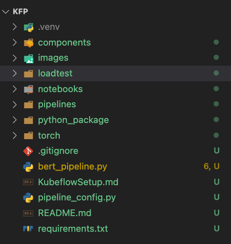

# ML Ops Code Structure

ml



├── README.md

├── bert_pipeline.py  Pipeline that runs all the kubeflow components

├── components        Different kubeflow components as per the functionality

        ├── deploy        Components for deploying to serving endpoint
    
        ├── evaluate      Components for capturing metadata  

        ├── preprocess    Data Preprocessing component

        ├── storage       Component for moving files from/to GCS 
 
        └── train         Training component code. e.g BERT training 

├── loadtest          Load testing using Jmeter  

├── data              Sample representative data for testing

├── notebooks         Exploration Notebooks

├── pipelines         Eventually all pipelines will be moved here

├── python_package    Houses python package for training models  

└── requirements.txt  

### Installing programs

* Create a virtual environment

```
python3 -m venv <virtualenv-name>
```

* We should update pip, Python's dependency manager:
```
pip install --upgrade pip
```

* Install the packages from requirements.txt
```
pip3 install -r requirements.txt
```

<b> NOTE </b>: If an error message of `Installation Error - Failed building wheel for tokenizers` then please install rust compiler and re-run the installation command above.

```
curl --proto '=https' --tlsv1.2 -sSf https://sh.rustup.rs | sh
source $HOME/.cargo/env
```

# How to run the pipeline

## Vertex AI

You'll need to authenticate against a service account that has access to Vertex Ai and [Vertex AI Service Agent](https://gcp.permissions.cloud/predefinedroles/aiplatform.serviceAgent)

```bash
gcloud auth <service-account>  --key-file=<key-file>
```


You'll need to set the below variables to run the pipeline.

```bash
export PROJECT_ID="mlops"
export REGION="us-central1"
export BUCKET_NAME="ankit-test-pipeline"
export BERT_TRAINING_DATA_BUCKET="ankit-test-data"
export BERT_TRAINING_DATA="reviews.csv"
export MODEL_NAME="finetuned-bert-classifier"
```

```bash
python bert_pipeline.py
```

Manual steps that still need automation

1. Python Packaging
    Python Package needs to be uploaded to the bucket before training.
    For automation we need a pipeline component to copy the code from git to gcs bucket
    ```bash
     cd python_package;
     tar cvf bert.tar bert; gzip -f bert.tar; gsutil cp bert.tar.gz gs://${BUCKET_NAME}/bert.tar.gz
     ```
    
2.  Model archiver needs certain files to be uploaded to the bucket
    ```bash
    gsutil cp ./torch/predictor/custom_handler.py gs://${BUCKET_NAME}/${MODEL_NAME}/serve/predictor/
    gsutil cp ./torch/predictor/index_to_name.json gs://${BUCKET_NAME}/${MODEL_NAME}/serve/predictor/
    gsutil cp ./torch/predictor/Dockerfile.serve gs://${BUCKET_NAME}/${MODEL_NAME}/serve/
    ```
## Kubeflow

Install [Kubeflow](<KubeflowSetup.md>)

